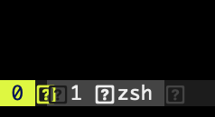
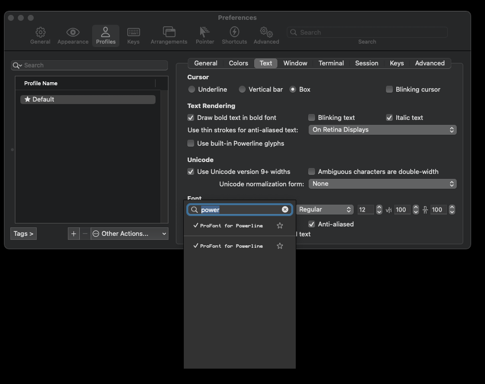

## Bootstrap
```bash
./setup.sh
```

Rodou o script e ficou com isso aqui no terminal?



Baixe o [Powerline](https://github.com/powerline/fonts/blob/master/ProFont/ProFont%20For%20Powerline.ttf)

Selecione ele no iTerm:

